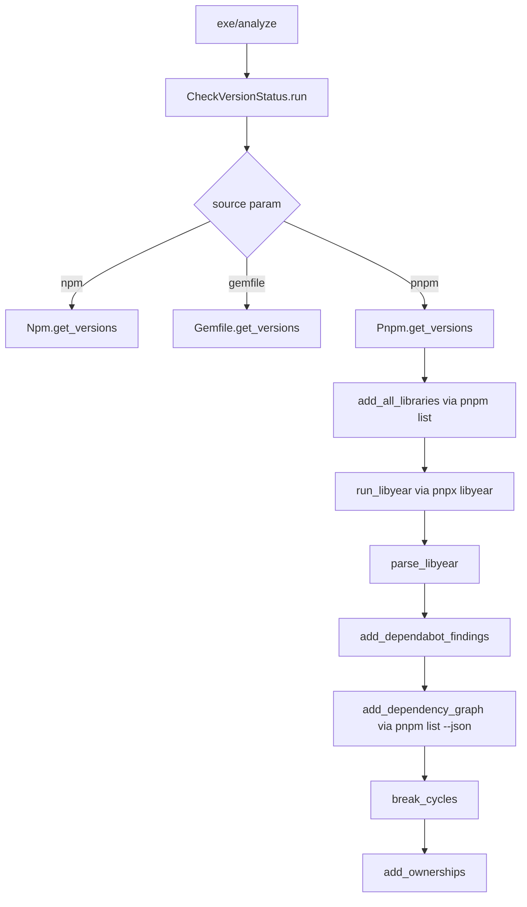
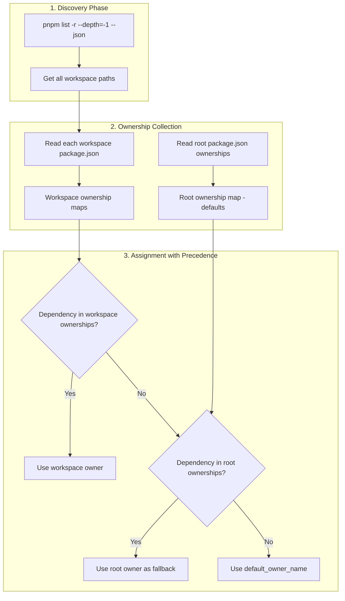

# Add pnpm Workspace Support

## Overview

Extend the library version analysis tool to support pnpm workspaces. The existing codebase follows a strategy pattern where each package manager (npm, gemfile) implements a `get_versions(source)` method. Adding pnpm support follows the same pattern.

## Key Discovery: libyear pnpm Support

The `libyear` npm package already supports pnpm natively:

- `--package-manager pnpm` - explicitly specify pnpm
- `--all` - include dependencies from the whole project (workspaces)
- `--json` - output JSON format

Command: `pnpx libyear --package-manager pnpm --all --json`

## Architecture



## Files to Modify/Create

### 1. Create [lib/library_version_analysis/pnpm.rb](lib/library_version_analysis/pnpm.rb) (new file)

Create a new class mirroring the structure of `Npm` class:

```ruby
module LibraryVersionAnalysis
  class Pnpm
    include LibraryVersionAnalysis::Ownership
    
    def get_versions(source)
      # Same flow as Npm:
      # 1. add_all_libraries (via pnpm list --depth=Infinity)
      # 2. run_libyear (via pnpx libyear --package-manager pnpm --all --json)
      # 3. parse_libyear
      # 4. add_dependabot_findings
      # 5. add_dependency_graph (via pnpm list --json --depth=Infinity)
      # 6. break_cycles
      # 7. add_ownerships
    end
  end
end
```

Key differences from npm.rb:

- Use `pnpm list --depth=Infinity` instead of `npm list --all`
- Use `pnpx libyear --package-manager pnpm --all --json` for libyear
- Use `pnpm list --json --depth=Infinity` for dependency graph
- Handle workspace structure in JSON parsing (pnpm has different JSON output format)

### 2. Modify [lib/library_version_analysis.rb](lib/library_version_analysis.rb)

Add require statement:

```ruby
require "library_version_analysis/pnpm"
```

### 3. Modify [lib/library_version_analysis/check_version_status.rb](lib/library_version_analysis/check_version_status.rb)

Add case handler and dispatcher method:

```ruby
# In go method (around line 111):
case source
when "npm"
  meta_data, mode = go_npm(spreadsheet_id, repository, source)
when "gemfile"
  meta_data, mode = go_gemfile(spreadsheet_id, repository, source)
when "pnpm"  # NEW
  meta_data, mode = go_pnpm(spreadsheet_id, repository, source)
else
  # ...
end

# New dispatcher method:
def go_pnpm(spreadsheet_id, repository, source)
  puts "  pnpm" if LibraryVersionAnalysis.dev_output?
  pnpm = Pnpm.new(repository)
  meta_data, mode = get_version_summary(pnpm, "PnpmVersionData!A:Q", spreadsheet_id, repository, source)
  return meta_data, mode
end
```

### 4. Modify [lib/library_version_analysis/github.rb](lib/library_version_analysis/github.rb)

Add ecosystem mapping for Dependabot:

```ruby
SOURCES = {
  "npm": "NPM",
  "gemfile": "RUBYGEMS",
  "pnpm": "NPM",  # pnpm uses npm registry
}.freeze
```

### 5. Create [spec/pnpm_spec.rb](spec/pnpm_spec.rb) (new file)

Add tests following the pattern in `spec/npm_spec.rb`:

- Test parsing of pnpm list output
- Test dependency graph building
- Test ownership assignment
- Test cycle breaking

## Implementation Notes

### pnpm list JSON format

pnpm's JSON output differs from npm. Example structure:

```json
[
  {
    "name": "workspace-root",
    "dependencies": { ... }
  },
  {
    "name": "@scope/package-a",
    "path": "/path/to/packages/a",
    "dependencies": { ... }
  }
]
```

The parser needs to handle the array-of-packages format for workspaces.

### Cascading Ownership from package.json Files

Ownership follows a **cascading model** where workspace-level definitions override root-level defaults:



**Precedence rules:**

1. **Workspace package.json wins** - If a workspace explicitly defines an owner for a dependency, that takes precedence
2. **Root package.json is fallback** - If workspace doesn't specify, fall back to root's ownership definition
3. **Default owner** - If neither defines it, use `Configuration.get(:default_owner_name)`

**Example structure:**

```
monorepo/
├── package.json          # Root ownerships (defaults)
│   └── ownerships: { "lodash": "platform-team", "react": "frontend-team" }
├── pnpm-workspace.yaml
├── packages/
│   ├── app-a/
│   │   └── package.json  # Can override: { "ownerships": { "lodash": "app-a-team" } }
│   └── app-b/
│       └── package.json  # No ownerships defined → inherits from root
```

In this example:

- `lodash` in app-a → owned by `app-a-team` (workspace override)
- `lodash` in app-b → owned by `platform-team` (root fallback)
- `react` everywhere → owned by `frontend-team` (root default)

**Implementation in pnpm.rb:**

```ruby
def add_ownerships(parsed_results)
  # 1. Collect all ownership definitions
  root_ownerships = read_package_json_ownerships("package.json")
  workspace_ownerships = collect_workspace_ownerships  # Hash of { workspace_name => { dep => owner } }
  
  # 2. Apply ownerships with precedence
  apply_cascading_ownerships(parsed_results, root_ownerships, workspace_ownerships)
  
  # 3. Transitive ownership (existing logic)
  add_transitive_ownerships(parsed_results)
  
  # 4. Attention needed for vulnerabilities
  add_attention_needed(parsed_results)
end

def collect_workspace_ownerships
  workspaces = discover_workspaces  # via pnpm list -r --depth=-1 --json
  ownerships = {}
  
  workspaces.each do |ws|
    pkg_json_path = File.join(ws["path"], "package.json")
    next unless File.exist?(pkg_json_path)
    
    ownerships[ws["name"]] = read_package_json_ownerships(pkg_json_path)
  end
  
  ownerships
end
```

### CI/CD Considerations

Similar to the npm implementation, the libyear command may need to be run separately before analysis to avoid memory issues. The output file would be `libyear_report.txt` (same as npm) or a pnpm-specific name like `pnpm_libyear_report.txt`.